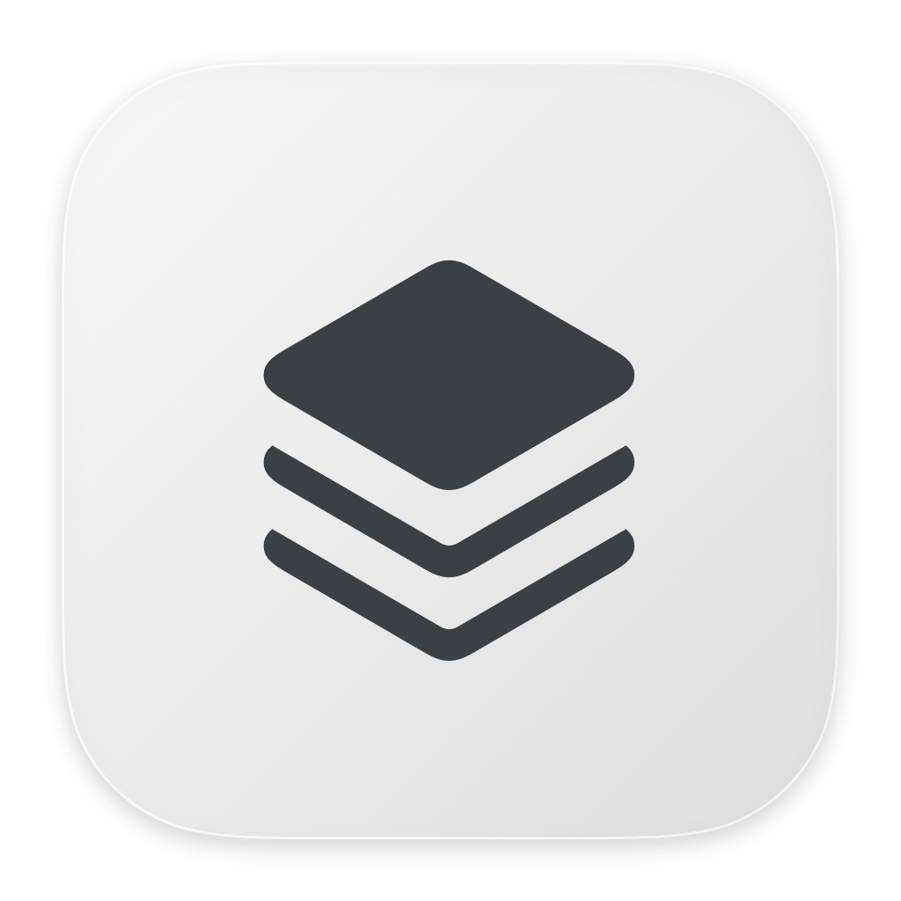
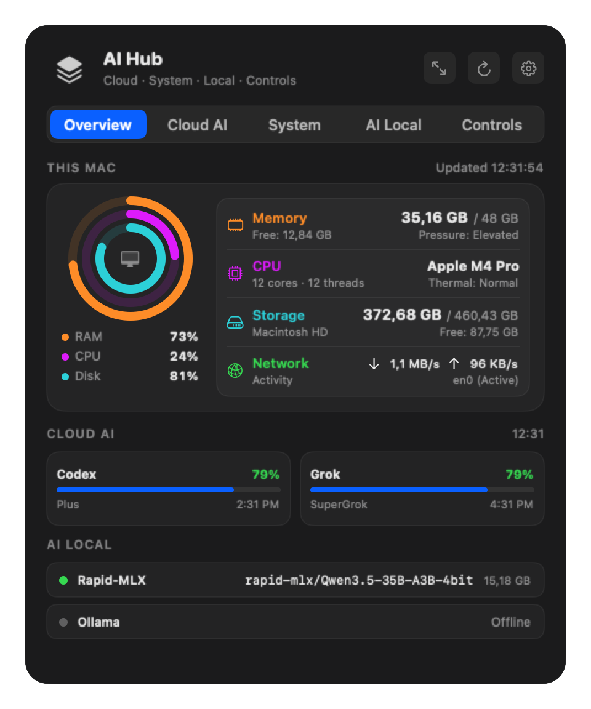

# AI Hub (v1.0.0)

  

  <strong>Native macOS Menu Bar Hub & Desktop Monitor for AI Quotas, Local Inference, System Telemetry, and Network Controls</strong>

  
  
  
  
  

---

## 🌟 Overview

**AI Hub** is a lightweight, ultra-performant, native macOS status bar application and desktop widget suite designed for developers, AI engineers, and power users. Built from the ground up using **SwiftUI**, **AppKit**, and **WidgetKit**, AI Hub unifies cloud AI quota tracking, local AI model management, hardware telemetry, and fast network profile switching into a single, cohesive dashboard.

  

---

## ✨ Key Features

### 🖥️ Hardware Telemetry (This Mac)
- **Concentric Ring Gauges**: Real-time visual monitoring for Memory (Orange), CPU (Purple), and Disk (Teal).
- **Comprehensive Hardware Specs**:
  - **Memory**: Active usage, total capacity, real-time free memory, and kernel memory pressure.
  - **CPU**: Apple Silicon processor identification, core count, thread count, and thermal state.
  - **Storage**: Used and total disk capacity, volume name, and available free space.
  - **Network Throughput**: Real-time Download (`↓`) and Upload (`↑`) throughput metrics and interface activity.

### ☁️ Cloud AI Quota Monitoring
- Real-time rate-limit tracking for major AI coding assistants and models:
  - **Codex (OpenAI)**
  - **Grok (xAI)**
  - **Claude (Anthropic)**
  - **Antigravity (Google Cloud / Gemini)**
- Clean, equal-width cards with progress indicators and countdown timers to quota reset.
- Secure OAuth authentication stored strictly in the native macOS Keychain.
 
### 💻 Local AI Inference Management
- Seamless integration with local inference engines:
  - **Rapid-MLX** (Apple Silicon MLX framework)
  - **Ollama**
  - **LM Studio**
- Real-time online/offline status, port configuration, active model names, memory footprints, and 1-click model unloading to free unified RAM.

### 🌐 Network Controls (L2 & VLAN Testing)
- Instant network adapter interface inspection and configuration.
- **DHCP Auto-Detection**: Live IP, Subnet mask, and Router display.
- **Fast Static IP Assignment**:
  - Optional Gateway (ideal for L2 isolated VLAN testing).
  - Smart subnet mask auto-completion (`255.255.255.X`).
  - Single-prompt macOS administrator authorization session.

### 🎨 Modular Tab Customization & Equal Width Bar
- Built-in Settings to toggle the visibility of any section:
  - **Overview**, **Cloud AI**, **System**, **AI Local**, **Controls**.
- Dynamic, automatically balanced segmented tab bar with pixel-perfect distribution across all screen sizes.

### 📌 Native macOS Desktop Widgets
- Standalone **WidgetKit Extension** supporting Small, Medium, and Large desktop widgets.
- Shared container architecture using sandboxed App Groups.

---

## 🚀 Installation & Requirements

### System Requirements
- **macOS**: Sonoma (14.0) or later
- **Architecture**: Apple Silicon (All Apple M-series chips: M1, M2, M3, M4, M5, M6 and later) or Intel Mac
- **Permissions**: Standard user permissions (Administrator prompt only requested on-demand when applying network static IP profiles)

### Download & Install
1. Download the latest `AI-Hub-v1.0.0.zip` from [GitHub Releases](https://github.com/b4chnh/AI-Hub/releases/latest).
2. Unzip the downloaded file.
3. Drag **AI Hub.app** into your `/Applications` folder.
4. Open **AI Hub** from `/Applications` or Spotlight. An icon will appear in your macOS menu bar.

---

## 💬 Feedback & Issues

If you encounter any issues or have feature requests, please [open an issue](https://github.com/b4chnh/AI-Hub/issues) on GitHub.

---

## 🔒 Security & Privacy

- **No Remote Telemetry**: AI Hub never collects, transmits, or logs your private data.
- **Keychain Security**: All OAuth tokens and API secrets reside exclusively in the native macOS Keychain.
- **Sandboxed Extension**: The WidgetKit extension communicates solely via sanitized read-only snapshots and never possesses token access.

---

## 🛠️ Tech Stack & Architecture

- **Language**: Swift 5.10 (Modern Concurrency, Swift 6 `@Observable`)
- **Frameworks**: SwiftUI, AppKit, WidgetKit, SystemConfiguration, Security, Network, CryptoKit
- **Packaging**: Hardened Runtime, Codesign, Sandboxed App Groups

---

## 📄 License

This project is licensed under the [MIT License](LICENSE).
